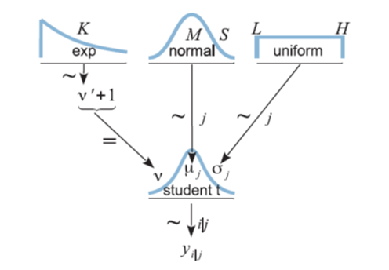

After reading the book from Krushke and going back and forth between the "time-varying-anova-example" file and the Stan model "time-varying" there are certain things that I still don't understand:

1. Krushke uses diagrams (like one below) to illustrate how models are built
```{r Fig 1., echo=FALSE, fig.cap="Krushke's diagram for two groups, metric response analysis", out.width='60%'}

```

From what I have understood,in the diagram the response is expected to come from a $t$ distribution where the three parameters $\nu,\mu$ and $\sigma$.
The examples I have seen on Krushke using Stan following something like this:

\begin{align}
y_n=\alpha+\beta*x_n+\epsilon_n \tag{1}\\
\end{align}

where $\epsilon_n \sim normal(0,\sigma)$ 
or \[y_n \sim normal(\alpha+\beta x_n,\sigma)$ $(2)\]

The parameters in Stan are then defined:

* alpha
* beta 
* sigma

And the model appears in the model block as:
$y\sim normal(alpha+beta*x,sigma)$

I know you have mentioned this before, but I am a little confused by how the argument is passed in the model in "time-varying.stan". The parameter $\beta$ is a matrix of 6 rows and two columns, and then is transformed into $\mu$, another matrix with row number equal to the total number of observations and 2 columns. And each $\mu$ is a combination of the basis functions of the spline and the $\beta$ parameter.

When the final model is specified,I don't fully understand how the model would look if specified as in $1$.
